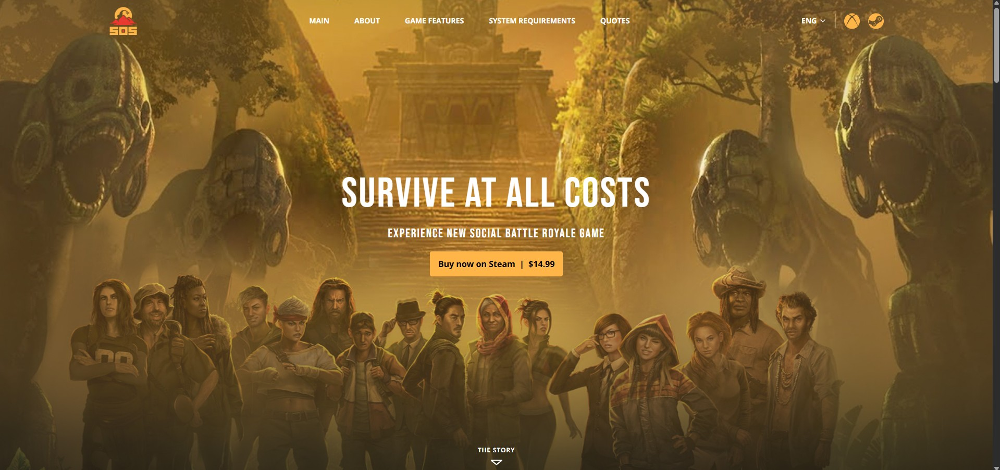

# SOS Game Landing Page 🎮

This is a responsive and accessible landing page for the game **SOS**, built using [Next.js](https://nextjs.org/), [Tailwind CSS](https://tailwindcss.com/), and [Framer Motion](https://www.framer.com/motion/). It showcases the game’s features, testimonials, system requirements, and more with a focus on clean visuals and smooth animations.

## 📸 Preview


## 🚀 Features

- ⚡ **Fully responsive** layout (mobile-first)
- 🎨 **Modern design** with smooth scroll animations
- 🌐 **Language selector** dropdown
- 🗣️ **Press quotes/testimonials** section
- 🧑‍💻 Accessible and semantic HTML
- 🎥 Animated scroll indicators using Framer Motion
- 🖼️ Optimized images using Next.js `Image` component
- 🧪 Hover interactions with official platform colors (Steam, Xbox, Discord, Facebook, Twitter)

## 🛠️ Tech Stack

- [Next.js 15](https://nextjs.org/)
- [React 19](https://react.dev/)
- [Tailwind CSS](https://tailwindcss.com/)
- [Framer Motion](https://www.framer.com/motion/)
- [Lucide Icons](https://lucide.dev/)
- [ESLint + Prettier] for formatting and linting

## 🧾 Accessibility

- Keyboard-navigable language menu
- Semantic roles and ARIA labels for better screen reader support
- High contrast for text and buttons

## 📦 Installation

```bash
git clone https://github.com/yourusername/sos-landing-page.git
cd sos-landing-page
npm install
npm run dev
```

## 📃 License
This project is licensed under the MIT License.

## 🙌 Acknowledgments
Figma Design inspiration: [SOS game](https://www.figma.com/design/wfT2CTCZaM5rwBLDMFKsKe/Game-Landing-freebie-by--alicilinia--Community-?node-id=0-1&p=f&t=Qlpm1mBiTTeGlV3u-0)

